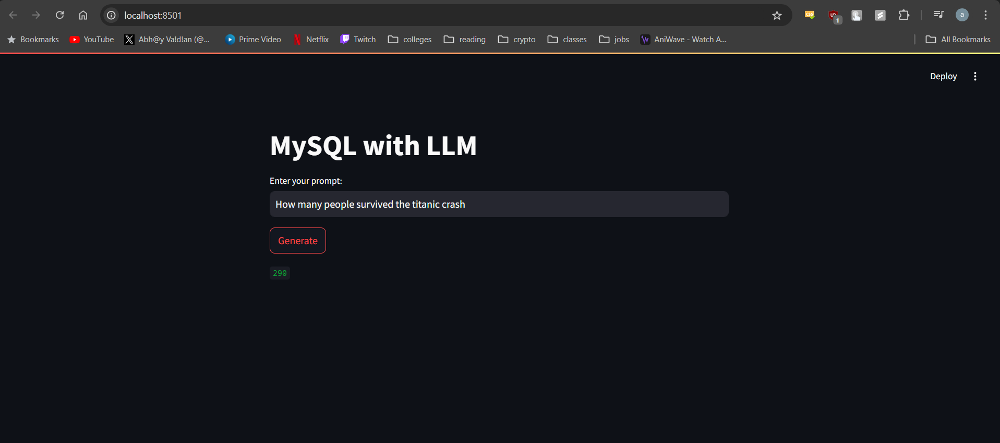
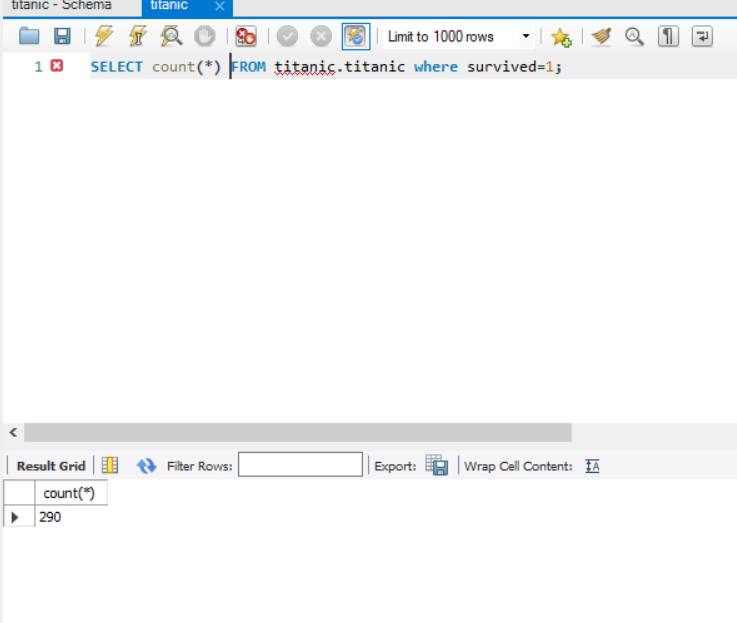

# Objective:
The primary goal was to create an intuitive and interactive data analysis tool that allows users to perform complex data queries without requiring advanced technical skills, thereby democratizing data access and analysis.

## Key Contributions:

Advanced NLP Integration:

Integrated BambooLLM to facilitate natural language processing, enabling users to interact with the data using conversational language.
Enhanced user experience by making data querying more accessible and reducing the need for SQL knowledge.

Efficient Database Connectivity:

Established a robust connection to a MySQL database hosting the Titanic dataset using MySQLConnector.
Ensured secure and efficient data retrieval and manipulation.

Interactive User Interface:

Developed an interactive web interface using Streamlit, allowing users to input queries and receive real-time responses.
Simplified user interactions with the data analysis tool through a clean and intuitive design.

Smart Data Processing:

Utilized PandasAI's SmartDataframe for intelligent data handling and processing.
Supported flexible data interactions, including both CSV file and direct database interactions.

## Tools and Technologies:

PandasAI: Smart data processing and analysis.
BambooLLM: Natural language processing and understanding.
Streamlit: User interface development for interactive web applications.
MySQL: Database management and connectivity.
Python: Core programming language for development.

## Result

